# AI Pilot Top Gun Challenge 2026 — F-16 1 vs 1 공중전 AI

>  JSBSim 환경에서 **계층적 아키텍처 + Discrete SAC + potential-based reward shaping + 커리큘럼 러닝** 으로 전투기 Dogfight AI agent 개발 
**[AI Pilot Top Gun Challenge 2026 (Notion)](https://hot-pike-57a.notion.site/AI-Pilot-Top-Gun-Challenge-2026-3b55e8dc640081e0b2a3f802b161ee1e?source=copy_link)**

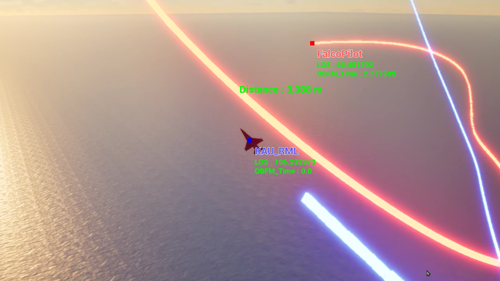

| | |
|---|---|
| **대회** | 제1회 한국항공대학교 총장배 2026 AI Pilot Top Gun Challenge — 국내 최초 전투기 1 vs 1 공중전 시뮬레이션 AI 경진대회 |
| **규모** | 전국 80개 대학 · 290팀 · 873명 참가 |
| **기간** | 2026.05 – 진행 중 · 온라인 예선 8/27–28 (Swiss system) · 본선 9/17 (16팀) |
| **참여** | 팀 프로젝트 — 아키텍처 설계부터 학습·평가까지 팀원과 공동 수행 |
| **환경** | JSBSim 기반 고충실도 6-DOF 비행 동역학 (대회 공식 빌드) · F-16 |
| **Stack** | Python · PyTorch · Ray RLlib · JSBSim · C++ (Behavior Tree DLL) |

---

## 1. 문제 — 왜 단일 정책 RL로는 풀리지 않는가

교전은 200초, 1 vs 1, 기총 전용이다. 명중 판정은 매 틱 **`ATA < 반각` ∧ `152 m ≤ R ≤ 914 m`** 를 만족하는 순간 데미지가 누적되는 순수 기하 게이트다. 대회 규격 반각은 **1°** 다.

세 가지 난점이 동시에 걸린다.

1. **고차원 연속 제어** — JSBSim은 실제 항공기 수준의 6-DOF 동역학을 푼다. throttle·aileron·elevator·rudder를 매 틱 직접 출력하는 flat policy는 탐색 공간이 지나치게 넓다.
2. **극단적으로 희소한 보상** — 반각 1°는 사거리 상한 914 m에서 **좌우 ±16 m**의 콘이다. 무작위 탐색으로 이 창을 통과시킬 확률은 사실상 0이며, 학습 초기에 유효한 보상 신호가 발생하지 않는다.
3. **장기 credit assignment** — 승패는 200초 끝에서 갈리지만, 승부를 만든 기동은 그보다 수십 초 앞에 있다.

> [!IMPORTANT]
> 그래서 알고리즘을 바꾸는 대신 **문제의 표현을 바꾸는 것**을 첫 설계 목표로 삼았다. 학습이 감당할 부분과 사람이 설계해 줄 부분의 경계를 어디에 그을 것인가가 이 프로젝트의 핵심 질문이었다.

---

## 2. 접근 — 계층적 아키텍처

공중전 전술 기동을 **10개의 교전모드**로 구조화하고, 연속 제어 문제를 **1 Hz 주기의 이산 의사결정 문제**로 재정의했다. 정책은 "조종간을 어떻게 움직일까"가 아니라 "지금 어떤 기동을 할까"만 결정한다.

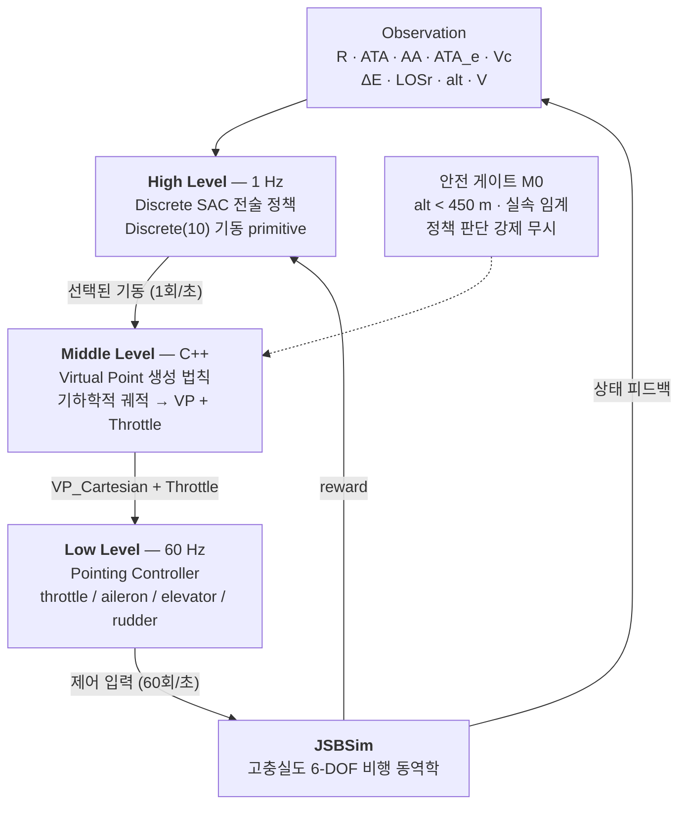

| 계층 | 역할 | 설계 의도 |
|---|---|---|
| **High** (1 Hz) | 10개 교전모드 중 하나를 선택 | 탐색 공간을 연속 제어에서 이산 전술 선택으로 축소한다. 학습 대상이 "전술"로 한정되므로 sample efficiency와 사후 해석 가능성이 함께 확보된다. |
| **Middle** | Virtual Point 생성 법칙 — 추상적 기동 명령을 단일 목표점으로 환원 | 학습 없이 결정론적으로 동작한다. **Middle Level에서 physical feasibility를 부여할 수 있다는 점이 핵심이다.** 정책이 물리적 타당성을 다시 학습할 필요가 없고, 전 모드가 `VP(Vector3) + Throttle(float)` 하나로 표현되므로 하위 제어기를 수정하지 않고 확장할 수 있다. |
| **Low** (60 Hz) | VP 추종 비행 제어 | 검증된 제어기를 활용해 학습 부담에서 제외한다. 상위 정책의 탐색이 기체 안정성을 해치지 않는다. |
| **M0 게이트** | 고도 450 m 미만·실속 임계에서 강제 회복 | 유일한 하드 마스크다. 전술적으로 나쁜 선택은 마스킹하지 않고 potential 하락이 자연 페널티로 작동하게 두었다 — 무엇이 왜 나쁜지를 정책이 직접 배우게 하기 위해서다. |

### 알고리즘 선택 — 왜 Discrete SAC인가

계층화로 행동공간이 Discrete(10)으로 줄면서 알고리즘 선택의 쟁점도 달라졌다.

- **off-policy 샘플 재사용** — 고충실도 시뮬레이션에서 교전 한 판은 비싸다. replay buffer로 과거 교전을 반복 재학습하는 off-policy 계열이, 업데이트마다 데이터를 버리는 on-policy(PPO) 대비 같은 시뮬 예산에서 더 많이 배운다.
- **최대 엔트로피 탐색** — 희소 보상에서 최대 위험은 정책이 한 가지 안전한 기동으로 조기 수렴하는 것이다. SAC는 엔트로피 보너스로 "아직 확신 없는 모드"를 계속 시도하게 만들고, 그 강도(온도 α)는 목표 엔트로피를 향해 자동 조절된다.

> [!NOTE]
> **엔지니어링 노트** — Discrete SAC는 연속 SAC만큼 정비된 경로가 아니어서, 라이브러리 기본값 두 곳을 실측으로 교정해야 했다.
> ① 이산 행동공간에서 target entropy 자동값이 −1.0으로 계산돼 온도 α가 0으로 붕괴(탐색 소멸) → 0.7·ln 10 ≈ 1.6을 명시하자 α가 건강하게 어닐링됨을 확인했다.
> ② 기본 prioritized replay buffer가 장기 학습 중 내부 자료구조 오류로 학습을 세 차례 중단시켜 uniform buffer로 교체했다 — 부수적으로 샘플링 속도도 개선됐다.

---

## 3. 행동공간 — 10개 교전 모드

BFM 교본의 전술 기동을 검토해, **VP 단일점 + Throttle로 실현 가능한 것만** 골라 10개로 확정했다. 시저스·배럴롤 어택·디스플레이스먼트 롤 등 롤축 시퀀스가 본질인 기동은 pointing controller로 표현 불가능하므로 근거를 남기고 명시적으로 제외했다.

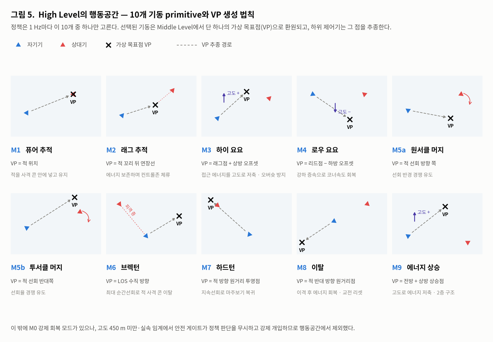

행동공간은 `Discrete(10) = [M1, M2, M3, M4, M5a, M5b, M6, M7, M8, M9]` 이다. M0는 안전 게이트가 강제 개입하는 모드라 정책이 선택할 수 없다.

### Middle Level — 기동을 수식으로

각 모드는 학습 없는 결정론적 법칙이다. 출력은 전 모드가 "가상 목표점 VP + 목표 속도"라는 하나의 계약으로 통일되고 60 Hz로 재계산된다. 대표 세 가지:

| 모드 | VP 생성 법칙 | 설계 의도 |
|---|---|---|
| **M1** 퓨어 추적 | $`VP = P_{tgt}`$ | 명중 판정이 탄도 시뮬레이션이 아니라 순간 기하 게이트이므로, 탄속 기반 리드 보정은 이 환경에 존재하지 않는 물리량에 근거한다 — 검토 후 폐기했고, 실측 정상상태 ATA 0.49°로 불필요가 확정됐다. |
| **M4** 로우 요요 | $`VP = P_{lead} - \hat{z}\,d_{yo}`$ , $`d_{yo} = \mathrm{clamp}\big(k_1 \max(0, -\Delta E) + k_2 \max(0, V_c - V),\ 0,\ \min(600,\ alt - 600)\big)`$ | 에너지 결핍에 비례해 강하 깊이를 정하되, 상한을 하드덱 마진과 연동해 클램프한다 — 공격 기동의 안전 제약이 수식 안에 내장된다. |
| **M9** 에너지 상승 | $`VP = P_{own} + \hat{F}_{hor} \cdot 2000 + \hat{z}\,h_{climb}`$ , $`h_{climb} = \mathrm{clamp}(k_3 \cdot \Delta E_{deficit},\ 200,\ 800)`$ | 상승점의 방위각을 시선 ±60° 이내로 클램프해, 에너지를 회복하는 동안에도 적을 시야에서 놓치지 않게 한다. |

커밋 기동(M4·M6~M9)은 스로틀 1.0 고정이고, 추적 계열(M1·M2)은 접근율 목표를 만들어 하위 제어기가 소화한다 — "목표 생성"과 "제어 실행"의 분리가 계층 전체에서 유지된다.

대표적으로 M1 퓨어 추적에서 M2 래그 추적으로의 모드 전환 궤적과 VP 생성을 검증한 결과:

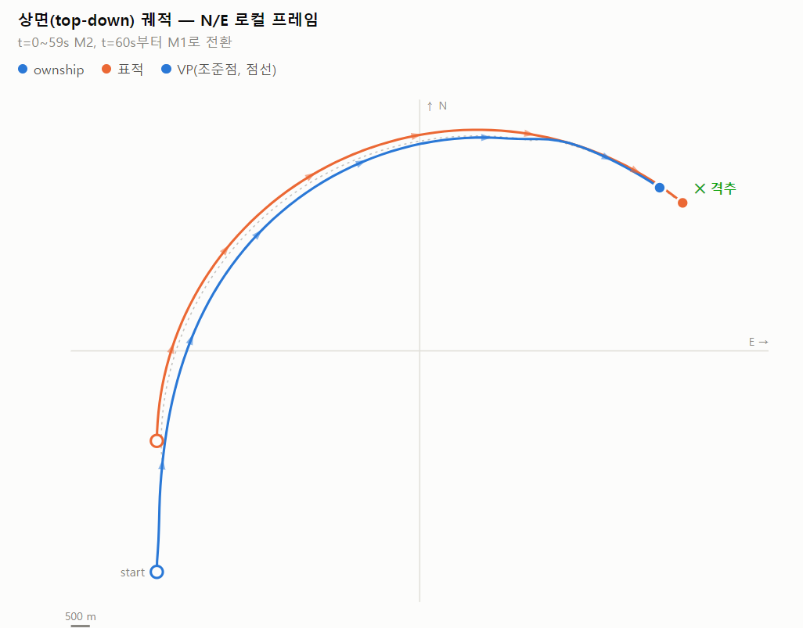

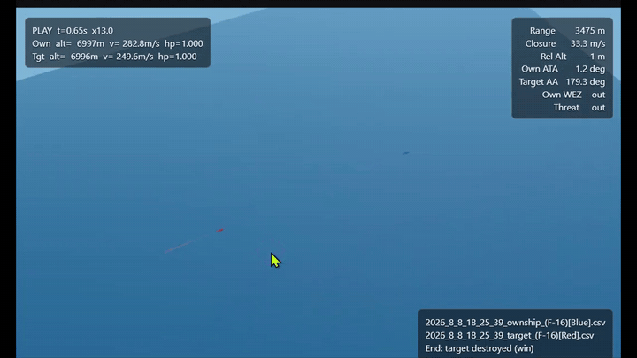

<sub>▶ 원본 화질: [mode_switch_demo.mp4](assets/mode_switch_demo.mp4)</sub>

---

## 4. 보상 설계 — 단일 potential function

초기 설계안은 **모드마다 다른 평가함수**로 상태 개선을 채점하는 것이었다. 이 안은 폐기했다. 모드별 평가함수는 "어떤 상태에서 어떤 모드가 좋은가"라는 인과관계를 사람이 미리 하드코딩하는 것이고, 그러면 신경망이 대체하는 것은 룩업테이블뿐이어서 Behavior Tree로 짜는 것과 실질적 차이가 없다.

대신 **모드와 무관한 단일 potential function Φ(s)** 를 정의하고 Ng et al.의 potential-based shaping을 적용했다. 최적 정책이 보존되면서 보상 밀도만 올라간다.

```math
\Phi(s) = w_{geom}\cdot\text{geom} + w_{wez}\cdot\text{band}\cdot\text{geom} + w_{E}\cdot g(R)\cdot\text{energy} - w_{safe}\cdot\text{barrier}(alt)
```

```math
r_t = \gamma\Phi(s_{t+1}) - \Phi(s_t) + 40\cdot\Delta\text{damage} + r_{terminal}
```

| 항 | 정의 | 설계 근거 |
|---|---|---|
| **geom** (w=6) | `(cos ATA + cos AA) / 2` ∈ [−1, +1] | 선형식과 달리 꼬리를 잡힌 불리한 자세에 음수 벌점이 존재한다. |
| **band × geom** (w=2) | 사거리 가우시안 `exp(−((R−533)/400)²)` 과의 곱 | 곱항이 "사거리 안 + 불리한 각도 = 적 WEZ 위협" 페널티를 자동으로 구현한다. |
| **energy** (w=1) | 비에너지 차 `tanh(ΔE/1500)` · 거리 게이트 적용 | 초기 학습 실측에서 상대 이탈 시 M9 에너지 상승만 파밍하는 징후(200스텝 중 42스텝)를 관측해, 교전권 밖(3.5 km 초과)에서 0으로 감쇠시켰다. |
| **barrier** (w=4) | 고도 800 m 이하부터 하드덱까지 이차 벌점 | M0 강제 개입 이전에 점진적 gradient를 준다. Stage C 실측 자추락 8 %가 저고도 몰이 부작용으로 확인돼 가중치를 2 → 4로 올렸다. |
| **terminal** | 격추 승 +100 / 피격 패 −100 / 자추락 −120 / 적 추락 +10 / 무승부 −30 + 60·Δhp | 적 추락은 승리지만 소액만 준다 — 동일하게 주면 상대 실수를 기다리는 소극 정책이 된다. 자추락을 피격 패보다 무겁게 둬 저고도 공격기동을 보수적으로 허용한다. |

> [!NOTE]
> **각 보상의 스케일 검토** — PBRS 차분 약 [+9, −13] < damage ±40 < terminal [−120, +100]. 기총 격추 경로 총합(+100 +40)이 HP 우위 타임아웃(+30 +40)보다 항상 우월하도록 설계해, shaping이 터미널 보상을 압도하지 않으면서도 결정타 유인이 유지되게 했다.

---

## 5. 커리큘럼

희소 보상을 우회하려면 초기 단계에서 "WEZ 유지 → 데미지 → 격추"라는 인과사슬을 최소한 한 번은 경험시켜야 한다. 상대 반응성 · 초기 교전 기하 조건 · 승리 판정 기준 세 축을 함께 완화한 뒤 대회 규격으로 되돌리는 4단계를 구성했다.

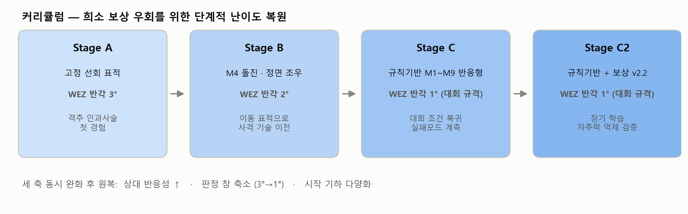

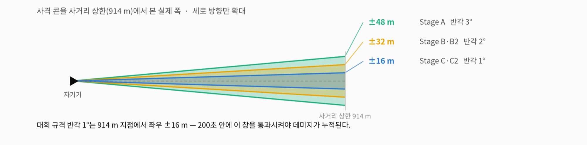

| 단계 | 상대 | WEZ 반각 | 결과 |
|---|---|---|---|
| **A** | 선회 고정 표적 (loiter) | 3° | 격추까지의 인과사슬을 안정적으로 재현 — 파이프라인 실증 |
| **B** | M4 돌진 · 정면 조우 | 2° | 이동 표적 상대 첫 기총 격추 · 타임아웃 소멸 |
| **C** | 규칙기반 M1~M9 반응형 | 1° (대회 규격) | 격추 0 · 자추락 8 % — 저고도 몰이 부작용 확인 |
| **C2** | 규칙기반 · 보상 v2.2 | 1° (대회 규격) | 아래 6절 |

---

## 6. 결과 — Stage C2 학습 교전 전수 집계

> [!NOTE]
> 아래 수치는 최종 단계 학습에서 기록된 교전 트레이스의 **전수 집계**다(비율 기준). 예선(8/27–28) 전이므로 대회 성적은 아직 없다.

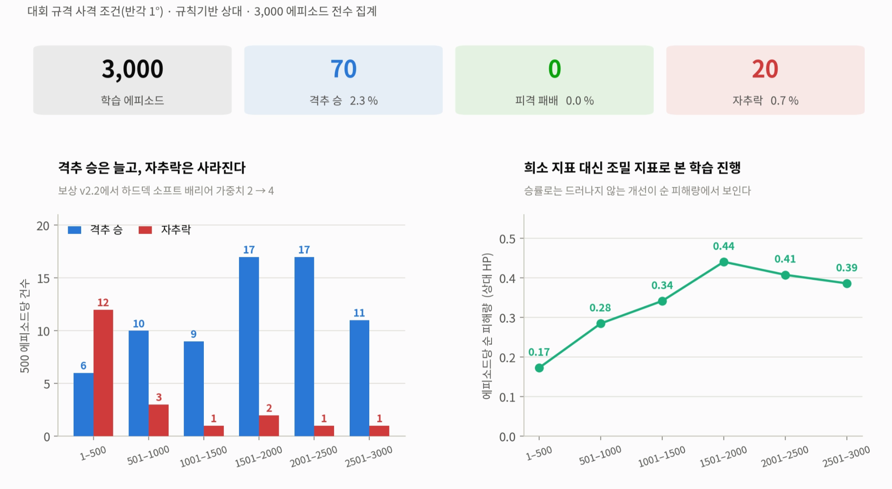

<p>
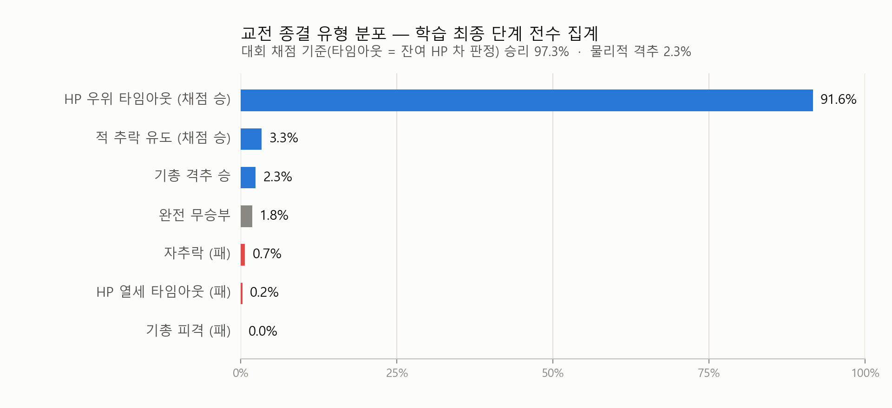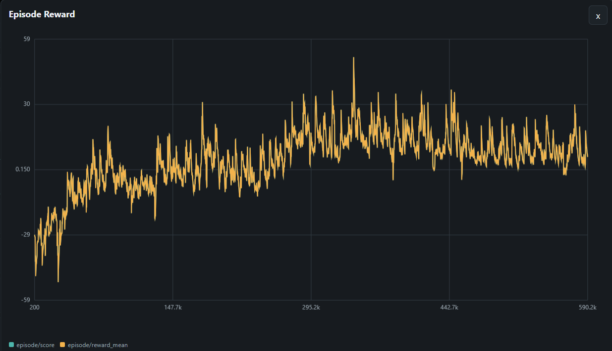
</p>

| 결과 | 비율 | 해석 |
|---|---|---|
| **기총 격추 승** | 2.3 % | 물리적 격추. 학습 후반 구간 발생률이 초반의 약 1.8배로 상승 추세이나, 절대 수준은 아직 낮다. |
| **적 추락 유도 승** | 14.1 % | 상대를 저고도로 몰아 지면 충돌시키는 창발 전술. 대회 규칙상 승리지만, 상대 결함 의존성이 있어 보수적으로 평가한다. |
| **HP 우위 타임아웃** | 80.9 % | 대회 채점(타임아웃 시 잔여 HP 차 판정) 기준 승리. 다만 결정타 없이 판정으로 이긴다는 본질은 그대로다. |
| **완전 무승부 · HP 열세** | 2.0 % | 피해 교환이 전혀 없거나 근소 열세로 종료된 교전. |
| **자추락** | 0.7 % | 학습 초반 대비 후반 구간 1/7 수준으로 감소 — `w_safe` 2 → 4 조정이 의도대로 작동했다. |
| **기총 피격 패배** | 0.0 % | 전 교전에서 단 한 번도 상대 기총에 격추되지 않았다. 방어·회피 쪽 정책은 이미 동작한다. |

대회 채점 기준으로는 97.3 %가 승리로 집계되지만, **타임아웃 종결이 97 %로 지배적이라는 사실 자체가 가장 큰 미해결 과제다** — 판정으로 이길 뿐 결정타로 끝내지 못한다. 격추는 희소해 학습 진행을 보기 어려우므로, 조밀 지표인 **에피소드당 순 피해량**으로 보면 학습 초반 `0.17`에서 최고 구간 `0.44`까지 2.6배 개선됐다. 정책은 분명히 학습되고 있지만, 반각 1° 조건에서 결정타까지 이어지지 못한다.

### 격추에 성공한 교전은 무엇이 달랐나

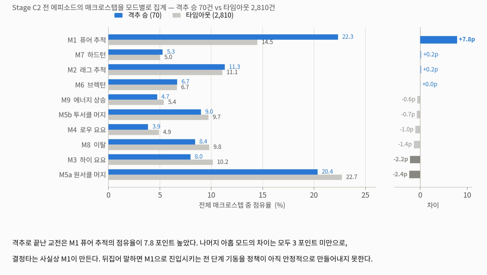

전 에피소드의 매크로스텝을 모드별로 집계해 두 집단을 비교했다. 유의미한 차이는 하나뿐이었다 — **M1 퓨어 추적의 점유율이 7.8 포인트 높다** (22.3 % vs 14.5 %). 나머지 아홉 모드의 차이는 모두 3 포인트 미만이다.

결정타는 사실상 M1이 만든다. 뒤집어 말하면, **M1으로 진입시키는 전 단계 기동을 정책이 아직 안정적으로 만들어내지 못하는 것**이 병목이다.

### 실제 교전 재생


<sub>▶ 원본 화질: [engagement_replay.mp4](assets/engagement_replay.mp4)</sub>

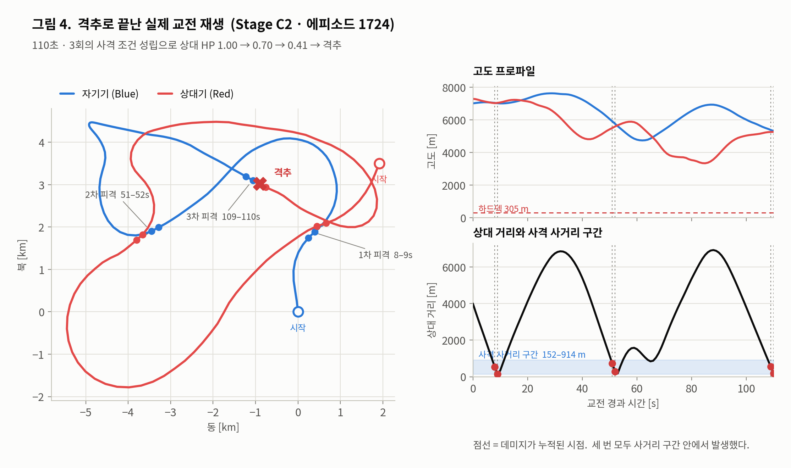

110초 동안 세 차례 사격 조건이 성립해 상대 HP가 `1.00 → 0.70 → 0.41 → 격추`로 떨어졌다. 세 번 모두 사거리 구간(152–914 m) 안에서 발생했고, ownship은 피격을 받지 않았다. 보상 곡선만 보지 않고 궤적을 직접 재생해 확인하는 것을 검증 절차로 삼았다.

---

*학습 코드·규칙기반 상대·검증 도구는 팀 비공개 저장소에서 관리한다. 본 저장소는 프로젝트 설계와 결과를 정리한 포트폴리오 문서다.*
