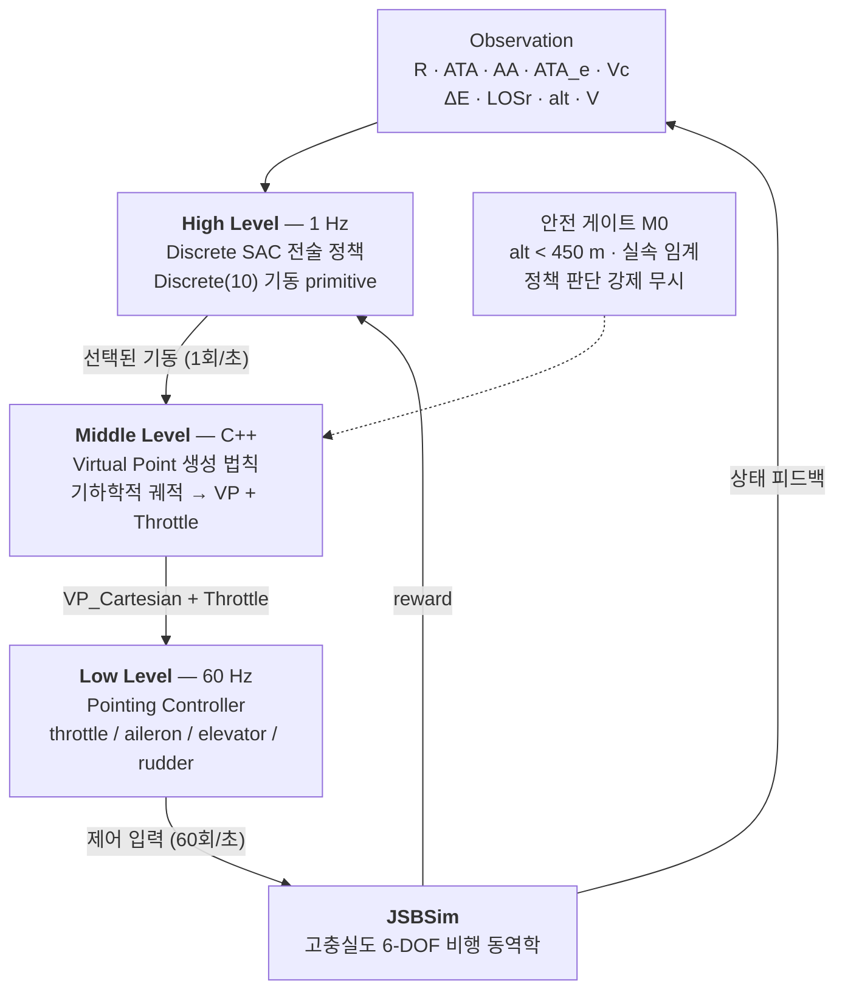

# AI Pilot Top Gun Challenge 2026 — F-16 1 vs 1 공중전 AI

>  JSBSim 환경에서 **계층적 아키텍처 + Discrete SAC + potential-based reward shaping + 커리큘럼 러닝** 으로 전투기 Dogfight AI agent 개발 
**[AI Pilot Top Gun Challenge 2026 (Notion)](https://hot-pike-57a.notion.site/AI-Pilot-Top-Gun-Challenge-2026-3b55e8dc640081e0b2a3f802b161ee1e?source=copy_link)**


| | |
|---|---|
| **대회** | 제1회 한국항공대학교 총장배 2026 AI Pilot Top Gun Challenge — 국내 최초 전투기 1 vs 1 공중전 시뮬레이션 AI 경진대회 |
| **규모** | 전국 80개 대학 · 290팀 · 873명 참가 |
| **기간** | 2026.05 – 진행 중 · 온라인 예선 8/27–28 (Swiss system) · 본선 9/17 (16팀) |
| **참여** | 팀 프로젝트 — 아키텍처 설계부터 학습·평가까지 팀원과 공동 수행 |
| **환경** | JSBSim 기반 고충실도 6-DOF 비행 동역학 (대회 공식 빌드) · F-16 |
| **Stack** | Python · PyTorch · Ray RLlib · JSBSim · C++ (Behavior Tree DLL) |

---

## 1. 자율 전투기 공중전 AI 에이전트 end-to-end-RL의 어려움

전투기 1:1 공중전 dogfight에서는 상대 기체를 추적하는 것 뿐만이 아니라, 상대와의 거리, 방향, 접근 속도 및 상대 기동을 고려하여 유리한 공격 기하를 형성하는 것이 중요하다. 또한 매 순간 상황의 유불리에 맞게 최적의 기동을 수행해야 하므로 강화학습이 key가 될 수 있을 것이지만 state에서 제어 명령까지 생성하는 end-to-end-RL 구조는 비합리적라고 판단했다. 그 근거는 다음과 같다.

1. **고차원 연속 제어** — JSBSim은 실제 항공기 수준의 6-DOF 동역학을 푼다. throttle·aileron·elevator·rudder를 매 스텝 직접 출력하는 policy는 탐색 공간이 지나치게 넓다.
2. **극단적으로 희소한 보상** — 반각 1°는 사거리 상한 914 m에서 **좌우 ±16 m**의 콘이다. 무작위 탐색으로 이 창을 통과시킬 확률은 사실상 0이며, 학습 초기에 유효한 보상 신호가 발생하지 않는다.
3. **장기 credit assignment** — 승패는 200초 끝에서 갈리지만, 승부를 만든 기동은 그보다 수십 초 앞에 있다.

---

## 2. 접근 — 계층적 아키텍처

공중전 전술 기동을 **10개의 교전모드**로 구조화하고, 연속 제어 문제를 **1 Hz 주기의 이산 의사결정 문제**로 재정의했다. 정책은 "조종간을 어떻게 움직일까"가 아니라 "지금 어떤 기동을 할까"의 최상위 교전모드를 선택하는 판단을 한다.



| 계층 | 역할 | 설계 의도 |
|---|---|---|
| **High** 1 Hz | 10개 교전모드중 하나를 선택 | 탐색 공간을 연속 제어에서 이산 전술 선택으로 축소한다. 학습 대상이 "전술"로 한정되므로 sample efficiency와 사후 해석 가능성이 함께 확보된다. |
| **Middle** | Virtual Point 생성 법칙 — 추상적 기동 명령을 단일 목표점으로 환원 | 학습 없이 결정론적으로 동작한다. **Middle Level에서 physical feasibility를 부여할 수 있다는 포인트가 핵심이라고 생각하였다.** 정책이 **물리적 타당성**을 다시 학습할 필요가 없고, 전 모드가 `VP(Vector3) + Throttle(float)` 하나로 표현되므로 하위 제어기를 수정하지 않고 확장할 수 있다. |
| **Low** 60 Hz | VP 추종 비행 제어 | 검증된 제어기를 활용해 학습 부담에서 제외한다. 상위 정책의 탐색이 기체 안정성을 해치지 않는다. |
| **M0 게이트** | 고도 450 m 미만·실속 임계에서 강제 회복 | 유일한 하드 마스크다. 전술적으로 나쁜 선택은 마스킹하지 않고 potential 하락이 자연 페널티로 작동하게 두었다 — 무엇이 왜 나쁜지를 정책이 직접 배우게 하기 위해서다. |

### 알고리즘 선택 — Discrete SAC

계층화로 행동공간이 이산적인 10개의 교전모드로 줄면서 알고리즘 선택의 쟁점도 달라졌는데 다음의 이유로 Discrete SAC를 채택했다.

- **off-policy 샘플 재사용** — 고충실도 시뮬레이션에서 교전 한 판은 비용이 적지 않다. replay buffer로 과거 교전을 반복 재학습하는 off-policy 계열이, 업데이트마다 데이터를 버리는 on-policy(PPO) 대비 같은 시뮬 예산에서 더 많이 학습할 수 있다.
- **최대 엔트로피 탐색** — 희소 보상에서 최대 위험은 정책이 한 가지 안전한 기동으로 조기 수렴하는 것이다. SAC는 엔트로피 보너스로 아직 확신 없는 모드를 계속 시도하게 만들고, 그 강도(온도 α)는 목표 엔트로피를 향해 자동 조절된다.
- SAC(Soft Actor-Critic)는 기본적으로 연속적인 행동 공간 제어를 위한 알고리즘이므로 행동 공간이 이산적일때 연속 표본 추출 대신 이산 확률 분포에 대한 기댓값을 직접 계산하도록 변형한 알고리즘인 Discrete SAC가 가장 최적의 알고리즘이라고 판단했다.

---

## 3. 행동공간 — 10개 교전 모드

BFM 교본의 전술 기동을 검토해, **VP 단일점 + Throttle로 실현 가능한 것만** 골라 10개로 확정했다. 시저스·배럴롤 어택·디스플레이스먼트 롤 등 롤축 시퀀스가 본질인 기동은 pointing controller로 표현 불가능하므로 근거를 남기고 명시적으로 제외했다.


행동공간은 `Discrete(10) = [M1, M2, M3, M4, M5a, M5b, M6, M7, M8, M9]`이다. M0는 안전 게이트가 강제 개입하는 모드라 정책이 선택할 수 없다.

### Middle Level — 기동을 수식으로

Middle Level에서는 High Level에서 결정한 행동, 즉 교전모드 별로 가상 목표점 VP 생성 법칙에 따라 가상 목표점 VP + 목표 속도를 60Hz로 출력한다. VP 생성 법칙은 비행체 유도항법제어와 추적 기하학의 이론을 참조하였다. 수식에 필요한 몇가지 파라미터는 middle level 단위의 테스트로 튜닝하였다.

대표 세 가지:

| 모드 | VP 생성 법칙 |
|---|---|
| **M1** 퓨어 추적 | $`VP = P_{tgt}`$ |
| **M4** 로우 요요 | $`VP = P_{lead} - \hat{z}\,d_{yo}`$ , $`d_{yo} = \mathrm{clamp}\big(k_1 \max(0, -\Delta E) + k_2 \max(0, V_c - V),\ 0,\ \min(600,\ alt - 600)\big)`$ |
| **M9** 에너지 상승 | $`VP = P_{own} + \hat{F}_{hor} \cdot 2000 + \hat{z}\,h_{climb}`$ , $`h_{climb} = \mathrm{clamp}(k_3 \cdot \Delta E_{deficit},\ 200,\ 800)`$ |

커밋 기동(M4·M6\~M9)은 스로틀 1.0 고정이고, 추적 계열(M1·M2)은 접근율 목표를 만들어 하위 제어기가 소화한다 — 목표 생성과 제어 실행의 분리가 계층 전체에서 유지된다. 전 모드의 생성 법칙과 폐루프 검증 기준은 팀 저장소에 문서화하였음.

대표적으로 M1 퓨어추적 기동모드 에서 M2 래그추적 기동모드로의 기동모드 전환의 궤적과 VP 생성을 검증한 리플레이는 아래와 같다.


<sub>▶ 원본 화질: [mode_switch_demo.mp4](assets/mode_switch_demo.mp4)</sub>

---

## 4. 보상 설계 — Potential-Based Reward Shaping

희소 보상 문제를 해결하기 위해 에이전트에게 도메인 지식을 중간 힌트로 줄때, 원래 환경의 최적 정책을 훼손하지 않도록 보상을 설계하기 위한 잠재함수인 Potential Function $`\Phi(s)`$ 을 사용하여 Potential-Based Reward Shaping 전략을 적용해보고자 하였다.

**모드와 무관한 단일 potential function Φ(s)** 를 다음과 같이 정의하였다.
위치우위(ATA/AA) + WEZ 점유 + 에너지우위 + 안전마진을 하나의 정규화된 스칼라 : `reward_t = Φ(S_{t+1}) - Φ(S_t)` + 터미널 승/패 보상

```math
\Phi(s) = w_{geom}\cdot\text{geom} + w_{wez}\cdot\text{band}\cdot\text{geom} + w_{E}\cdot g(R)\cdot\text{energy} - w_{safe}\cdot\text{barrier}(alt)
```

```math
r_t = \gamma\Phi(s_{t+1}) - \Phi(s_t) + 40\cdot\Delta\text{damage} + r_{terminal}
```

| 항 | 정의 | 설계 근거 + 업데이트 |
|---|---|---|
| **geom** `w=6` | `(cos ATA + cos AA) / 2` ∈ [−1, +1] | 선형식과 달리 꼬리를 잡힌 불리한 자세에 음수 벌점이 존재한다. |
| **band × geom** `w=2` | 사거리 가우시안 `exp(−((R−533)/400)²)` 과의 곱 | 곱항이 "사거리 안 + 불리한 각도 = 적 WEZ 위협" 페널티를 구현한다. |
| **energy** `w=1` | 비에너지 차 `tanh(ΔE/1500)` · 거리 게이트 적용 | 초기 학습 실측에서 상대 이탈 시 M9 에너지 상승만 파밍하는 징후(200스텝 중 42스텝)를 관측해, 교전권 밖(3.5 km 초과)에서 0으로 감쇠시켰다. |
| **barrier** `w=4` | 고도 800 m 이하부터 하드덱까지 이차 벌점 | M0 강제 개입 이전에 점진적 gradient를 준다. Stage C 실측 자추락 8 %가 저고도 몰이 부작용으로 확인돼 가중치를 2 → 4로 올렸다. |
| **terminal** | 격추 승 +100 / 피격 패 −100 / 자추락 −120 / 적 추락 +10 / 무승부 −30 + 60·Δhp | 적 추락은 승리지만 소액만 준다 — 동일하게 주면 상대 실수를 기다리는 소극 정책이 된다. 자추락을 피격 패보다 무겁게 둬 저고도 공격기동을 보수적으로 허용한다. |

> [!NOTE]
> **각 보상의 스케일 검토** — PBRS 차분 약 \[+9, −13\] \< damage ±40 \< terminal \[−120, +100\]. 기총 격추 경로 총합(+100 +40)이 HP 우위 타임아웃(+30 +40)보다 항상 우월하도록 설계해, shaping이 터미널 보상을 압도하지 않으면서도 결정타 유인이 유지되게 했다.

---

## 5. 커리큘럼 학습

희소 보상을 우회하려면 초기 단계에서 WEZ 유지 → 데미지 → 격추라는 인과사슬을 최소한 한 번은 경험시켜야 한다. 상대 반응성 · 초기 교전 기하 조건 · 승리 판정 기준 세 축을 함께 완화한 뒤 대회 규격으로 되돌리는 4단계를 구성했다.


| 단계 | 상대 | WEZ 반각 | 결과 |
|---|---|---|---|
| **A** | 선회 고정 표적 | 3° | 격추까지의 인과사슬을 안정적으로 재현 — 파이프라인 실증 |
| **B** | M4 돌진 · 정면 조우 | 2° | 이동 표적 상대 첫 기총 격추 · 타임아웃 소멸 |
| **C1** | 규칙기반 M1\~M9 반응형 | 1° (대회 규격) | 격추 0 · 자추락 8 % — 저고도 몰이 부작용 확인 |
| **C2** | 규칙기반 · 보상 v2.2 | 1° (대회 규격) | 아래 6절 |

---

## 6. 결과 — Stage C2 학습 교전 전수 집계


| 결과 | 비율 | 해석 |
|---|---|---|
| **기총 격추 승** | 2.3 % | 물리적 격추. 학습 후반 구간 발생률이 초반의 약 1.8배로 상승 추세이나, 절대 수준은 아직 낮다. |
| **적 추락 유도 승** | 3.3 % | 상대를 저고도로 몰아 지면 충돌시키는 창발 전술. 대회 규칙상 승리지만, 상대 결함 의존성이 있어 보수적으로 평가한다. |
| **HP 우위 타임아웃** | 91.6 % | 대회 채점(타임아웃 시 잔여 HP 차 판정) 기준 승리. 다만 결정타 없이 판정으로 이긴다는 본질은 그대로다. |
| **완전 무승부 · HP 열세** | 2.0 % | 피해 교환이 전혀 없거나 근소 열세로 종료된 교전. |
| **자추락** | 0.7 % | 학습 초반 대비 후반 구간 1/7 수준으로 감소 — `w_safe` 2 → 4 조정이 의도대로 작동했다. |
| **기총 피격 패배** | 0.0 % | 전 교전에서 단 한 번도 상대 기총에 격추되지 않았다. 방어·회피 쪽 정책은 이미 동작한다. |


대회 채점 기준으로는 97.3 %가 승리로 집계되지만, **타임아웃 종결이 97 %로 지배적이라는 사실 자체가 가장 큰 미해결 과제** — 판정으로 이길 뿐 데미지를 주어 적기의 HP를 깍아 결정타로 이기는 episode는 아직 충분히 발생하지 못하였다. 격추는 희소해 학습 진행을 보기 어려우므로, 조밀 지표인 episode **당 순 피해량**으로 보면 학습 초반 `0.17`에서 최고 구간 `0.44`까지 2.6배 개선됐다. 정책은 분명히 학습되고 있지만, 대회 WEZ 범위인 반각 1° 조건에서 기총 격추 승리의 빈도가 충분치는 못하다.

### 기총 격추 승리 요인 분석


모든 에피소드의 매크로스텝을 모드별로 집계해 두 집단을 비교했다. 유의미한 차이는 — **M1 퓨어 추적의 점유율이 7.8 포인트 높다** (22.3 % vs 14.5 %). 나머지 아홉 모드의 차이는 모두 3 포인트 미만.

기총 격추 승리는 사실상 M1 퓨어 추적 모드가 결정적인 역할을 한다고 분석 된다. 다시 말하면, M1으로 진입시키는 전 단계 기동을 정책이 아직 안정적으로 만들어내지 못하는 것이 병목으로 보인다.

### 실제 교전 재생


<sub>▶ 원본 화질: [engagement_replay.mp4](assets/engagement_replay.mp4)</sub>


위 교전 케이스는 110초 동안 세 차례 사격 조건이 성립해 상대 HP가 `1.00 → 0.70 → 0.41 → 격추`로 떨어졌다. 세 번 모두 사거리 구간(152–914 m) 안에서 발생했고, 파란색 ownship는 피격을 받지 않았다. 보상 곡선만 보지 않고 궤적을 직접 재생해 확인하는 것을 검증 절차로 삼았다.

---

*학습 코드·규칙기반 상대·검증 도구는 팀 비공개 저장소에서 관리한다. 본 저장소는 프로젝트 설계와 결과를 정리한 포트폴리오 문서다.*
